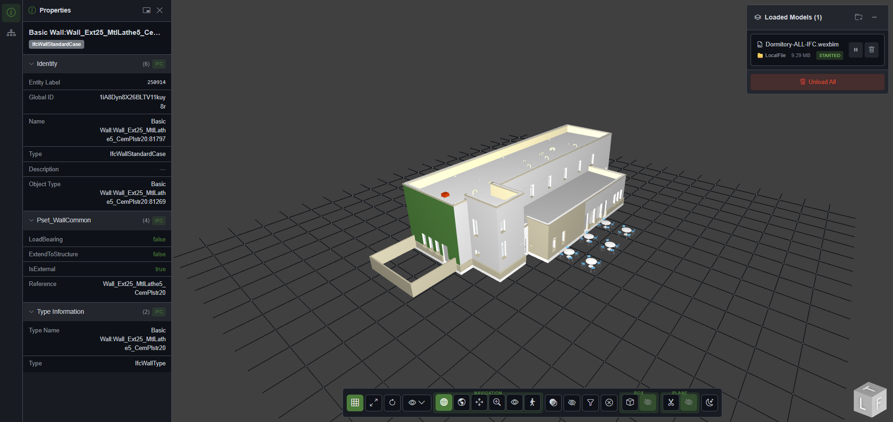

# Xbim WexSDK

[](https://github.com/Ibrahim5aad/Xbim.WexSDK/actions/workflows/ci.yml)
[](https://opensource.org/licenses/MIT)

An open-source SDK for building BIM (Building Information Modeling) applications with .NET 9. Xbim WexSDK (along with [Xbim.WexBlazor](https://github.com/Ibrahim5aad/Xbim.WexBlazor)) provides reusable components, a REST API server, and client libraries to accelerate the development of custom BIM solutions.

| Package | NuGet |
|---------|-------|
| Xbim.WexBlazor | [](https://www.nuget.org/packages/Xbim.WexBlazor) |
| Xbim.WexServer.Client | [](https://www.nuget.org/packages/Xbim.WexServer.Client) |



## What is Xbim?

Xbim is a toolkit for developers building BIM applications. It provides:

- **Blazor Component Library** - Drop-in 3D viewer components for visualizing IFC/wexBIM models
- **REST API Server** - Ready-to-deploy backend for model storage, processing, and management
- **Generated API Client** - Typed HTTP client for seamless server integration
- **Reference Implementation** - Full web application demonstrating all capabilities

## Architecture

```
Xbim.WexSDK/
├── src/
│   ├── Xbim.WexServer.Client             # Generated API client (NuGet package)
│   ├── Xbim.WexApp                       # Blazor web application
│   ├── Xbim.WexServer                    # ASP.NET Core REST API
│   ├── Xbim.WexServer.Domain             # Domain entities
│   ├── Xbim.WexServer.Contracts          # DTOs and API contracts
│   ├── Xbim.WexServer.Abstractions       # Interfaces and abstractions
│   ├── Xbim.WexServer.Persistence.EfCore # Entity Framework Core data access
│   ├── Xbim.WexServer.Processing         # Background job processing
│   ├── Xbim.WexServer.Storage.LocalDisk  # Local disk storage provider
│   ├── Xbim.WexServer.Storage.AzureBlob  # Azure Blob storage provider
│   ├── Xbim.WexServer.ServiceDefaults    # .NET Aspire shared configuration
│   └── Xbim.WexAppHost                   # .NET Aspire orchestration
└── tests/
    └── ...                               # Unit and integration tests

Xbim.WexBlazor/  (separate repo: github.com/Ibrahim5aad/Xbim.WexBlazor)
├── src/
│   └── Xbim.WexBlazor                    # Blazor component library (NuGet package)
└── samples/
    ├── Xbim.WexBlazor.Sample             # WebAssembly standalone demo
    └── Xbim.WexBlazor.Server.Sample      # Blazor Server demo with IFC support
```

## Features

### Server Features
- **Model Management** - Workspaces, projects, models, and versioning
- **IFC Processing** - Automatic conversion to wexBIM format using xBIM Geometry Engine
- **Property Extraction** - Extract and store IFC properties in database for fast retrieval
- **Multiple Storage Backends** - Local disk or Azure Blob Storage
- **Background Processing** - Async job queue for long-running operations
- **Role-Based Access** - Workspace and project membership with Owner/Member/Viewer roles

### Viewer Features

See [Xbim.WexBlazor](https://github.com/Ibrahim5aad/Xbim.WexBlazor) for the Blazor component library features including the 3D viewer, plugins, theming, and property display.

## Quick Start

### Running the Server

1. Configure the database and storage in `appsettings.json`:

```json
{
  "Database": {
    "Provider": "Sqlite"
  },
  "Storage": {
    "Provider": "LocalDisk",
    "LocalDisk": {
      "BasePath": "wex-storage"
    }
  }
}
```

2. Run the server:

```bash
dotnet run --project src/Xbim.WexServer
```

### Running with .NET Aspire

For local development with full orchestration:

```bash
dotnet run --project src/Xbim.WexAppHost
```

## Server Configuration

### Database Providers

**SQLite** (Development):
```json
{
  "Database": {
    "Provider": "Sqlite"
  }
}
```

**SQL Server** (Production):
```json
{
  "Database": {
    "Provider": "SqlServer"
  },
  "ConnectionStrings": {
    "DefaultConnection": "Server=...;Database=Xbim;..."
  }
}
```

### Storage Providers

**Local Disk**:
```json
{
  "Storage": {
    "Provider": "LocalDisk",
    "LocalDisk": {
      "BasePath": "wex-storage"
    }
  }
}
```

**Azure Blob Storage**:
```json
{
  "Storage": {
    "Provider": "AzureBlob",
    "AzureBlob": {
      "ConnectionString": "...",
      "ContainerName": "Xbim-models"
    }
  }
}
```

### Authentication

**Development Mode** (auto-injects test user):
```json
{
  "Auth": {
    "Mode": "Development",
    "Dev": {
      "Subject": "dev-user",
      "Email": "dev@localhost",
      "DisplayName": "Development User"
    }
  }
}
```

**JWT Bearer** (Production):
```json
{
  "Auth": {
    "Mode": "Bearer"
  }
}
```

## API Endpoints

The server exposes RESTful endpoints for:

| Endpoint | Description |
|----------|-------------|
| `/api/v1/workspaces` | Workspace management |
| `/api/v1/projects` | Project management |
| `/api/v1/models` | Model management |
| `/api/v1/models/{id}/versions` | Model versioning |
| `/api/v1/files` | File metadata |
| `/api/v1/files/upload` | File upload |
| `/api/v1/properties` | Element properties |
| `/api/v1/usage` | Storage usage statistics |

Full API documentation available at `/swagger` when running the server.

## Development

### Prerequisites

- .NET 9.0 SDK
- Node.js 20+ (for TypeScript compilation)
- SQL Server or SQLite

### Building

```bash
git clone https://github.com/Ibrahim5aad/Xbim.WexSDK.git
cd Xbim.WexSDK
dotnet build
```

### Running Tests

```bash
dotnet test
```

### Running Samples

**WebAssembly Sample** (standalone viewer):
```bash
dotnet run --project samples/Xbim.WexBlazor.Sample
```

**Blazor Server Sample** (with IFC processing):
```bash
dotnet run --project samples/Xbim.WexBlazor.Server.Sample
```

## Documentation

- [Xbim.WexBlazor Component Library](src/Xbim.WexBlazor/README.md)
- [Xbim.WexServer.Client API Client](src/Xbim.WexServer.Client/README.md)

## Technology Stack

- **Frontend**: Blazor (Server/WebAssembly), @xbim/viewer, TypeScript
- **Backend**: ASP.NET Core 9, Entity Framework Core 9
- **BIM Processing**: xBIM Essentials, xBIM Geometry Engine
- **Storage**: Local Disk, Azure Blob Storage
- **Orchestration**: .NET Aspire
- **Observability**: OpenTelemetry

## License

MIT

## Acknowledgements

- [@xbim/viewer](https://www.npmjs.com/package/@xbim/viewer) - WebGL BIM viewer
- [xBIM Toolkit](https://github.com/xBimTeam) - .NET BIM libraries
